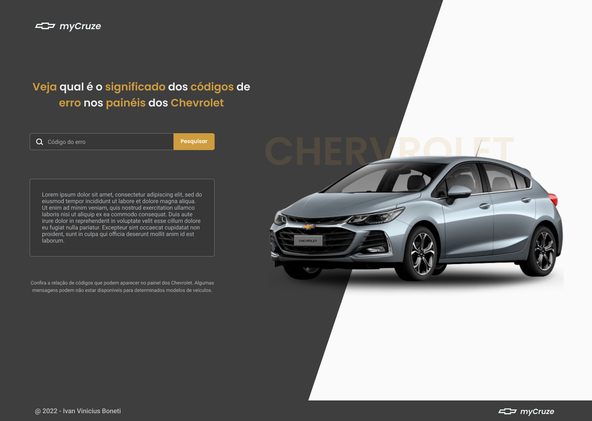

  

    
  

  <h4 align="center">Simple page to find out car troubles by code.</h4>

## Resumo

  <ol>
    <li><a href="#visão-geral-do-projeto">Visão geral do projeto</a></li>
    <li><a href="#sobre-o-projeto">Sobre o projeto</a></li>
    <li><a href="#tecnologias-utilizadas">Tecnologias utilizadas</a></li>
    <li><a href="#instalação-e-utilização">Instalação e utilização</a></li>
  </ol>

## Visão geral do projeto

    

## Sobre o projeto

Resumo

## Tecnologias utilizadas

As principais tecnologias utilizadas na construção deste projeto foram: 

* [Next.JS](https://nextjs.org/)
* [Stitches](https://stitches.dev/)

## Instalação e utilização

Instruções de instalação do projeto em seu computador.

### Pré-requisitos 

Instalações necessárias antes de executar o projeto.

1. Node
2. Yarn
  
### Instalação

1. Baixe as dependências do projeto utilizando o comando `$ yarn`.

2. Execute o projeto utilizando o comando `$ yarn dev `.

 

<h4 align="center"><a href="#top">Voltar ao Início</a></h4>